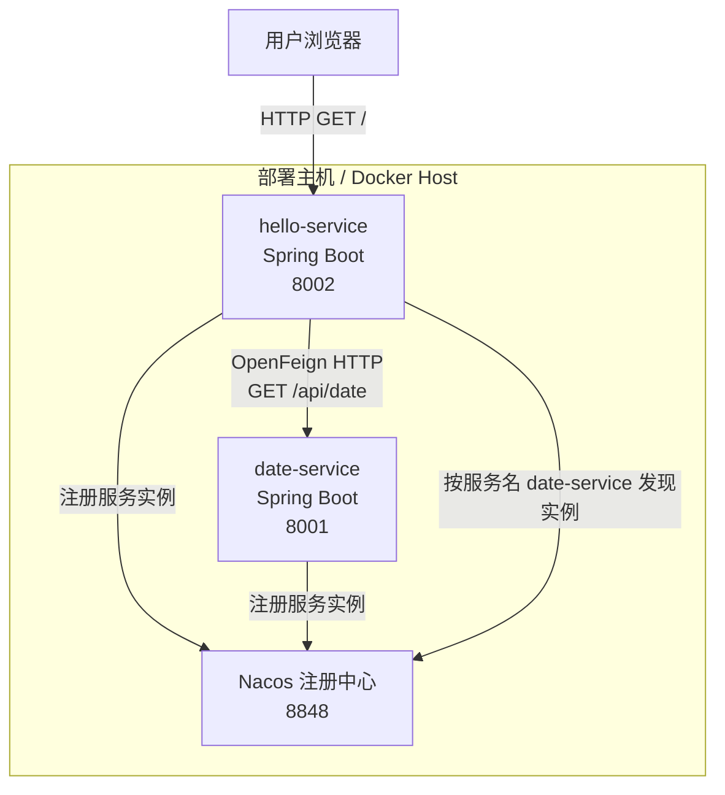
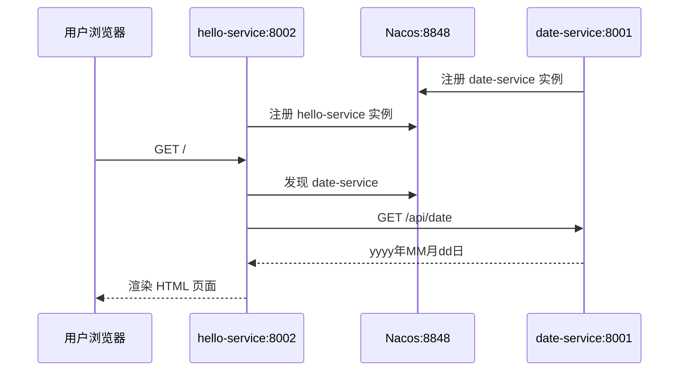

# Spring Cloud Demo 部署文档

本文档用于从 0 搭建并部署当前项目。项目包含两个微服务：

- `date-service`：日期服务提供者，提供当前日期 API。
- `hello-service`：页面服务消费者，通过 OpenFeign 调用 `date-service` 并渲染页面。

## 1. 项目功能

访问 `hello-service` 首页时，服务会通过 OpenFeign 调用 `date-service` 获取当前日期，然后通过 Thymeleaf 渲染页面，展示：

```text
yyyy年MM月dd日，你好
```

核心接口：

| 服务 | 端口 | 接口 | 说明 |
|---|---:|---|---|
| `date-service` | `8001` | `GET /api/date` | 返回当前日期，格式为 `yyyy年MM月dd日` |
| `hello-service` | `8002` | `GET /` | 调用 `date-service` 并展示页面 |

## 2. 技术栈

| 类型 | 技术 / 版本 |
|---|---|
| JDK | Java 8 |
| 构建工具 | Maven 3.x |
| 框架 | Spring Boot `2.3.12.RELEASE` |
| 微服务框架 | Spring Cloud `Hoxton.SR12` |
| Alibaba 组件 | Spring Cloud Alibaba `2.2.7.RELEASE` |
| 注册中心 | Nacos Discovery |
| 服务调用 | OpenFeign |
| 页面模板 | Thymeleaf |
| 容器化 | Docker |

## 3. 部署依赖

当前项目没有数据库访问逻辑，也没有缓存或消息队列逻辑。

| 组件 | 是否需要 | 用途 | 默认地址 |
|---|---|---|---|
| Nacos | 必须 | 服务注册与发现 | `127.0.0.1:8848` |
| MySQL | 不需要 | 项目未配置 datasource | 无 |
| Redis | 不需要 | 项目未引入 Redis 依赖 | 无 |
| RabbitMQ / Kafka | 不需要 | 项目未使用消息队列 | 无 |
| MongoDB / Elasticsearch | 不需要 | 项目未使用 | 无 |

## 4. 当前项目部署架构图



## 5. 微服务调用架构图

```mermaid
flowchart LR
    browser[Browser]
    controller[HelloController<br/>GET /]
    feign[DateClient<br/>@FeignClient date-service]
    registry[Nacos Discovery]
    dateApi[DateController<br/>GET /api/date]
    page[Thymeleaf<br/>hello.html]

    browser --> controller
    controller --> feign
    feign -->|查询服务实例| registry
    feign -->|HTTP 调用| dateApi
    dateApi -->|返回日期字符串| feign
    feign --> controller
    controller --> page
    page --> browser
```

## 6. 请求时序图



## 7. 应用配置路径

`date-service` 配置文件：

```text
date-service/src/main/resources/application.yml
```

```yaml
server:
  port: 8001

spring:
  application:
    name: date-service
  cloud:
    nacos:
      discovery:
        server-addr: 127.0.0.1:8848
```

`hello-service` 配置文件：

```text
hello-service/src/main/resources/application.yml
```

```yaml
server:
  port: 8002

spring:
  application:
    name: hello-service
  cloud:
    nacos:
      discovery:
        server-addr: 127.0.0.1:8848
  thymeleaf:
    cache: false
```

重要配置项：

| 配置项 | 说明 | 默认值 |
|---|---|---|
| `server.port` | 服务监听端口 | `8001` / `8002` |
| `spring.application.name` | 注册到 Nacos 的服务名 | `date-service` / `hello-service` |
| `spring.cloud.nacos.discovery.server-addr` | Nacos 地址 | `127.0.0.1:8848` |
| `spring.thymeleaf.cache` | Thymeleaf 模板缓存 | `false` |

## 8. 端口规划

| 组件 | 端口 | 访问说明 |
|---|---:|---|
| Nacos | `8848` | Nacos 控制台和服务注册发现 |
| `date-service` | `8001` | 内部 API，也可直接访问测试 |
| `hello-service` | `8002` | 用户访问入口 |

如果部署在服务器上，需要放通：

- `8002`：对用户开放。
- `8848`：仅管理或内网访问，生产环境不建议直接暴露公网。
- `8001`：建议仅内网访问。

## 9. 从 0 本地 Jar 部署

### 9.1 安装基础环境

需要安装：

- JDK 8
- Maven 3.x
- Docker，用于快速启动 Nacos

检查命令：

```bash
java -version
mvn -version
docker --version
```

### 9.2 启动 Nacos

```bash
docker run --name nacos \
  -d \
  -p 8848:8848 \
  -e MODE=standalone \
  nacos/nacos-server:2.0.3
```

检查 Nacos：

```bash
curl http://127.0.0.1:8848/nacos
```

浏览器访问：

```text
http://127.0.0.1:8848/nacos
```

### 9.3 编译项目

在项目根目录执行：

```bash
mvn clean package
```

生成产物：

```text
date-service/target/date-service-1.0.0.jar
hello-service/target/hello-service-1.0.0.jar
```

### 9.4 启动 date-service

```bash
java -jar date-service/target/date-service-1.0.0.jar
```

也可以显式指定端口和 Nacos 地址：

```bash
java -jar date-service/target/date-service-1.0.0.jar \
  --server.port=8001 \
  --spring.cloud.nacos.discovery.server-addr=127.0.0.1:8848
```

验证：

```bash
curl http://127.0.0.1:8001/api/date
```

预期输出类似：

```text
2026年04月25日
```

### 9.5 启动 hello-service

新开一个终端，在项目根目录执行：

```bash
java -jar hello-service/target/hello-service-1.0.0.jar
```

也可以显式指定端口和 Nacos 地址：

```bash
java -jar hello-service/target/hello-service-1.0.0.jar \
  --server.port=8002 \
  --spring.cloud.nacos.discovery.server-addr=127.0.0.1:8848
```

验证：

```bash
curl http://127.0.0.1:8002/
```

浏览器访问：

```text
http://127.0.0.1:8002/
```

## 10. 从 0 Docker 部署

### 10.1 构建 Jar

Dockerfile 会复制 `target/*.jar`，所以需要先构建：

```bash
mvn clean package
```

### 10.2 创建 Docker 网络

```bash
docker network create spring-cloud-demo-net
```

### 10.3 启动 Nacos

```bash
docker run --name nacos \
  -d \
  --network spring-cloud-demo-net \
  -p 8848:8848 \
  -e MODE=standalone \
  nacos/nacos-server:2.0.3
```

### 10.4 构建服务镜像

```bash
docker build -t date-service:1.0.0 date-service
docker build -t hello-service:1.0.0 hello-service
```

### 10.5 启动 date-service 容器

容器内的 `127.0.0.1` 指向容器自身，所以 Docker 部署时必须覆盖 Nacos 地址为 `nacos:8848`。

```bash
docker run --name date-service \
  -d \
  --network spring-cloud-demo-net \
  -p 8001:8001 \
  date-service:1.0.0 \
  --spring.cloud.nacos.discovery.server-addr=nacos:8848
```

### 10.6 启动 hello-service 容器

```bash
docker run --name hello-service \
  -d \
  --network spring-cloud-demo-net \
  -p 8002:8002 \
  hello-service:1.0.0 \
  --spring.cloud.nacos.discovery.server-addr=nacos:8848
```

### 10.7 验证 Docker 部署

查看容器：

```bash
docker ps
```

查看日志：

```bash
docker logs date-service
docker logs hello-service
```

验证日期服务：

```bash
curl http://127.0.0.1:8001/api/date
```

验证页面服务：

```bash
curl http://127.0.0.1:8002/
```

浏览器访问：

```text
http://127.0.0.1:8002/
```

## 11. 启动顺序

推荐启动顺序：

1. 启动 Nacos。
2. 启动 `date-service`。
3. 启动 `hello-service`。
4. 访问 `http://127.0.0.1:8002/`。

原因：

- 两个 Spring Boot 服务启动时会注册到 Nacos。
- `hello-service` 调用 `date-service` 时依赖 Nacos 服务发现。
- 如果 `date-service` 未注册成功，访问 `hello-service` 首页可能出现 Feign 调用失败。

## 12. 生产部署建议

当前项目是示例工程，生产化前建议补齐：

| 项目 | 建议 |
|---|---|
| 健康检查 | 引入 `spring-boot-starter-actuator`，暴露 `/actuator/health` |
| Nacos 高可用 | 使用 Nacos 集群，而不是 standalone 单机模式 |
| 日志 | 接入集中日志，例如 ELK、Loki 或云日志 |
| 资源限制 | Docker / Kubernetes 中设置 CPU、内存限制 |
| 配置管理 | 将环境差异配置放入 Nacos Config 或外部配置 |
| 镜像安全 | 不使用 `latest`，固定镜像版本 |
| 网络暴露 | 只对外暴露 `hello-service`，`date-service` 和 Nacos 走内网 |

## 13. 常见问题

### 13.1 Docker 中服务无法注册到 Nacos

原因通常是配置仍然使用：

```text
127.0.0.1:8848
```

在容器内，`127.0.0.1` 是当前容器，不是 Nacos 容器。需要改为：

```text
nacos:8848
```

或通过启动参数覆盖：

```bash
--spring.cloud.nacos.discovery.server-addr=nacos:8848
```

### 13.2 访问 hello-service 报 Feign 调用失败

检查：

```bash
docker logs hello-service
docker logs date-service
```

确认：

- Nacos 已启动。
- `date-service` 已注册到 Nacos。
- `hello-service` 使用的 Nacos 地址正确。
- 两个服务在同一个 Docker 网络内。

### 13.3 端口被占用

检查端口：

```bash
lsof -i :8001
lsof -i :8002
lsof -i :8848
```

可以通过启动参数修改服务端口：

```bash
--server.port=新端口
```

## 14. 一键清理 Docker 环境

停止并删除容器：

```bash
docker rm -f hello-service date-service nacos
```

删除网络：

```bash
docker network rm spring-cloud-demo-net
```

删除镜像：

```bash
docker rmi hello-service:1.0.0 date-service:1.0.0
```

