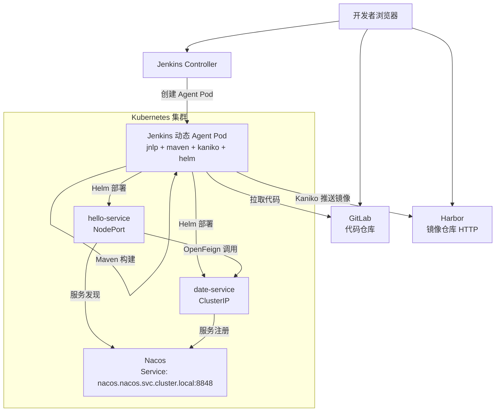
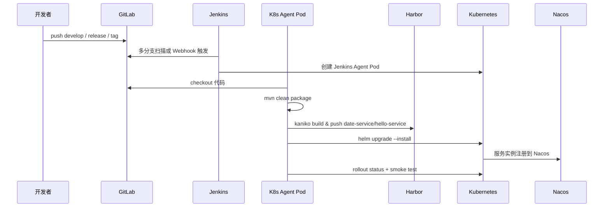

# 1-整体架构与部署规划

## 1-1. 组件职责

| 组件 | 作用 | 本实践中的用途 |
|---|---|---|
| GitLab | Git 代码仓库 | 保存 `spring-cloud-ex` 项目代码，触发 Jenkins 多分支流水线 |
| Jenkins | CI/CD 调度平台 | 拉代码、构建、推镜像、部署 Kubernetes |
| Harbor | 镜像仓库 | 保存业务镜像和 CI 工具镜像 |
| Kubernetes | 容器编排平台 | 运行 Nacos、Jenkins Agent Pod、业务服务 |
| Nacos | 注册中心 | `date-service` 和 `hello-service` 服务注册发现 |
| Maven | Java 构建工具 | 构建 Spring Boot Jar 包 |
| Kaniko | 容器镜像构建工具 | 在 K8s Pod 中无 Docker Daemon 构建镜像 |
| Helm | K8s 包管理工具 | 部署和回滚业务服务 |

## 1-2. DevOps 能力总览

本实践不是只把服务跑起来，而是落地一套最小可用的 DevOps 发布体系。

| 能力 | 是否覆盖 | 实现方式 |
|---|---|---|
| 代码托管 | 是 | GitLab 托管 `spring-cloud-ex` 项目 |
| 分支驱动发布 | 是 | Jenkins 多分支流水线识别 `develop`、`release/*`、`main`、`v*` tag |
| 自动构建 | 是 | Jenkins Agent Pod 中执行 Maven 构建 |
| 镜像构建 | 是 | Kaniko 构建 `date-service`、`hello-service` 镜像 |
| 镜像制品管理 | 是 | Harbor 保存业务镜像和 CI 工具镜像 |
| 多环境部署 | 是 | Helm 按 dev/test/prod values 部署到不同 Namespace |
| 配置差异管理 | 是 | `values-dev.yaml`、`values-test.yaml`、`values-prod.yaml` 管理差异 |
| 服务注册发现 | 是 | Nacos 按 `dev/test/prod` Namespace 隔离服务注册 |
| 发布验证 | 是 | Jenkins 执行 `kubectl rollout status` 和页面 smoke test |
| 失败自动回滚 | 是 | `helm upgrade --install --atomic` 部署失败自动回滚 |
| 手动回滚 | 是 | `helm history` + `helm rollback` 回滚指定版本 |
| 生产人工确认 | 是 | `main` 或 `v*` tag 发布 prod 前 Jenkins `input` 审批 |
| 离线插件支持 | 是 | 文档内置 Jenkins 插件包 |

最终交付链路：

```text
GitLab 代码 -> Jenkins 流水线 -> Maven 构建 -> Kaniko 镜像 -> Harbor 制品 -> Helm 部署 -> K8s 运行 -> Nacos 注册 -> 访问验证
```

## 1-3. 多环境发布规划

多环境的核心思路是：代码分支、镜像 Tag、K8s Namespace、Helm values、Nacos Namespace 一一对应。

| 环境 | 触发来源 | K8s Namespace | Nacos Namespace ID | Helm values | NodePort | 是否自动部署 | 是否人工审批 |
|---|---|---|---|---|---:|---|---|
| dev | `develop`、`feature/*` | `dev` | `dev` | `values-dev.yaml` | `30080` | 是 | 否 |
| test | `release/*` | `test` | `test` | `values-test.yaml` | `30081` | 是 | 否 |
| prod | `main`、`v*` tag | `prod` | `prod` | `values-prod.yaml` | `30082` | 是 | 是 |

多环境设计原则：

1. **同一份代码，多套配置**：不要为 dev/test/prod 维护三套代码，通过 Helm values 管理差异。
2. **同一套 Chart，多环境复用**：`deploy/helm/spring-cloud-demo` 是唯一部署模板。
3. **镜像不可变**：每次构建使用分支名加短 Commit 作为 tag，例如 `develop-b8c0988a`。
4. **环境隔离**：K8s Namespace 隔离资源，Nacos Namespace 隔离服务发现。
5. **生产可控**：`main` 和 `v*` tag 发布 prod 前都需要 Jenkins 人工确认。
6. **部署可回滚**：Helm 保留 release 历史，失败自动回滚，异常可手动回滚。

## 1-4. 回滚设计

本实践提供两层回滚：

| 回滚类型 | 触发方式 | 适用场景 | 命令/机制 |
|---|---|---|---|
| 自动回滚 | Jenkins 部署失败 | 新版本 Pod 起不来、健康检查失败、Helm 超时 | `helm upgrade --install --atomic --timeout 5m` |
| 手动回滚 | 人工执行 | 发布后业务验证异常，需要退回上一个稳定版本 | `helm history` + `helm rollback` |

手动回滚示例：

```bash
helm history spring-cloud-demo -n prod
helm rollback spring-cloud-demo <REVISION> -n prod
kubectl rollout status deployment/hello-service -n prod --timeout=120s
```

回滚后验证：

```bash
NODE_IP=10.1.106.71
NODE_PORT=30082
curl http://${NODE_IP}:${NODE_PORT}/
```

## 1-5. 项目落地挑战与规划思考

从 0 落地这套 CI/CD，真正容易卡住的不是 Spring Boot 代码，而是基础设施之间的连接和权限。

| 挑战 | 典型现象 | 规划方式 |
|---|---|---|
| 多系统兼容 | Ubuntu、CentOS、麒麟、云厂商系统命令不同 | 文档分别给出 `apt`、`yum/dnf`，并先做 Linux baseline |
| HTTP Harbor | Docker/K8s 拉镜像报 HTTPS 错误 | Docker 配置 `insecure-registries`，containerd 配置 `hosts.toml` |
| 离线环境 | 插件、镜像、安装包下载失败 | 准备 Jenkins 插件包、Harbor 离线包、CI 工具镜像 |
| Jenkins Agent | Agent Pod Pending 或连不上 Jenkins | 提前规划 `jenkins-agent` Namespace、`50000` 端口、K8s Cloud |
| 镜像来源 | Dockerfile 基础镜像来自不可访问仓库 | 统一同步基础镜像到 Harbor，或改用官方镜像 |
| 凭据管理 | 密码写进脚本或 Git 仓库 | 统一使用 Jenkins Credentials，文档只写示例密码格式 |
| 多环境隔离 | dev/test/prod 服务互相发现 | K8s Namespace + Nacos Namespace 双隔离 |
| 发布可追溯 | 不知道哪个版本部署到哪个环境 | 镜像 Tag 使用分支名 + Commit，Helm history 保留修订 |
| 回滚能力 | 发布失败需要手工改 YAML | Helm `--atomic` 自动回滚，保留 `helm rollback` 手动回滚方案 |
| 资源不足 | GitLab、Harbor、Jenkins、K8s 抢资源 | 文档给出最小资源要求和推荐拆分部署 |

规划时建议先回答 6 个问题：

1. **环境怎么分**：至少 dev/test/prod 三个逻辑环境。
2. **代码怎么流动**：`feature/* -> develop -> release/* -> main -> v* tag`。
3. **制品怎么命名**：镜像 tag 必须唯一、可追溯，不要用 `latest` 发布环境。
4. **配置怎么隔离**：Helm values 管 K8s 配置，Nacos Namespace 管服务注册。
5. **权限怎么收敛**：GitLab、Harbor、K8s、Nacos 密码全部进 Jenkins Credentials。
6. **失败怎么恢复**：先靠 Helm 自动回滚，再保留人工回滚命令。

## 1-6. 整体部署架构图



如果你的 Markdown 工具不支持 Mermaid，可以参考下面的文本版架构图：

```text
开发者浏览器
  ├─访问 GitLab：提交代码
  ├─访问 Jenkins：查看流水线
  └─访问 Harbor：查看镜像

Jenkins Controller
  └─在 Kubernetes 中创建 Jenkins Agent Pod
      ├─maven 容器：编译 Java 项目
      ├─kaniko 容器：构建镜像并推送 Harbor
      └─helm 容器：部署 date-service / hello-service

Kubernetes 集群
  ├─Nacos：服务注册中心
  ├─date-service：日期服务，ClusterIP
  └─hello-service：页面入口，NodePort
```

## 1-7. CI/CD 流程图



文本版 CI/CD 流程：

```text
1. 开发者 push 代码到 GitLab。
2. Jenkins 多分支扫描或 Webhook 发现变更。
3. Jenkins 在 Kubernetes 中创建 Agent Pod。
4. Agent Pod 拉取代码并执行 Maven 构建。
5. Kaniko 构建 date-service 和 hello-service 镜像。
6. Kaniko 推送镜像到 Harbor。
7. Helm 部署或升级 Kubernetes 中的应用。
8. 应用启动后注册到 Nacos。
9. Jenkins 执行 rollout 和页面访问验证。
```

## 1-8. 最小资源要求

| 场景 | 机器数量 | CPU | 内存 | 磁盘 | 说明 |
|---|---:|---:|---:|---:|---|
| 单机最小部署 | 1 | 8C | 16G | 200G | 所有组件一台机器，容易资源不足，不推荐生产长期使用 |
| 三机最小部署 | 3 | 总计 10C+ | 总计 20G+ | 总计 260G+ | 推荐最低部署规格 |
| 五机推荐部署 | 5 | 总计 16C+ | 总计 32G+ | 总计 500G+ | 推荐生产部署案例规格 |

单组件最低建议：

| 组件 | CPU | 内存 | 磁盘 |
|---|---:|---:|---:|
| GitLab | 4C | 8G | 100G |
| Harbor | 2C | 4G | 100G |
| Jenkins | 2C | 4G | 60G |
| K8s 单节点 | 4C | 8G | 100G |
| K8s 三节点 | 每节点 2C | 每节点 4G | 每节点 80G |

## 1-9. 端口规划

| 组件 | 端口 | 协议 | 说明 |
|---|---:|---|---|
| GitLab Web | `8929` | HTTP | GitLab 页面访问 |
| Harbor Web/Registry | `8088` | HTTP | Harbor 页面和镜像仓库 |
| Jenkins Web | `8080` | HTTP | Jenkins 页面访问 |
| Jenkins Agent | `50000` | TCP | Jenkins inbound agent 连接 |
| Kubernetes API | `6443` | TCP | Jenkins 访问 K8s |
| Nacos Web | `30848` | HTTP | Nacos NodePort |
| Nacos gRPC | `31848` / `31849` | TCP | Nacos 2.x 通信端口 |
| hello-service dev | `30080` | HTTP | dev 环境业务入口 |
| hello-service test | `30081` | HTTP | test 环境业务入口 |
| hello-service prod | `30082` | HTTP | prod 环境业务入口 |

云服务器安全组和本机防火墙都要放行这些端口。

## 1-10. 版本矩阵

| 软件 | 推荐版本 | 说明 |
|---|---|---|
| Docker Engine | `24.x` 或更新稳定版 | 安装方式以官方仓库为准 |
| Docker Compose | `v2` 插件 | 使用 `docker compose`，不是旧版 `docker-compose` |
| Kubernetes | `1.29+` 到当前稳定版 | 本实践参考 kubeadm 方式 |
| containerd | `1.7+` 或 `2.x` | K8s 容器运行时 |
| Helm | `3.16+` | Jenkins Agent 中执行部署 |
| GitLab CE | `18.9.2-ce.0` 示例 | 可按官方文档选择当前稳定版 |
| Harbor | `v2.14.1` 示例 | 本实践使用 HTTP 模式 |
| Jenkins | `2.541.2-lts-jdk21` 示例 | LTS + JDK21 镜像 |
| Nacos | `2.3.2` 示例 | K8s 中部署 standalone |
| Java | `8` | 项目使用 Spring Boot 2.3.x |
| Maven | `3.9.x` | 构建 Java 项目 |

## 1-11. 分支与环境规划

| Git 分支 / Tag | 镜像 Tag | 部署环境 | Namespace | NodePort |
|---|---|---|---|---:|
| `feature/*` | `feature-xxx-短Commit` | dev | `dev` | `30080` |
| `develop` | `develop-短Commit` | dev | `dev` | `30080` |
| `release/*` | `release-xxx-短Commit` | test | `test` | `30081` |
| `main` | `main-短Commit` | prod，人工确认 | `prod` | `30082` |
| `v*` tag | `v1.0.0` | prod，人工确认 | `prod` | `30082` |

## 1-12. 命名规划

| 对象 | 示例值 |
|---|---|
| Harbor 项目 | `devops-demo` |
| CI 工具镜像项目 | `ci-tools` |
| Helm Release | `spring-cloud-demo` |
| Jenkins Job | `spring-cloud-ex` |
| GitLab 项目 | `root/spring-cloud-ex` |
| K8s Nacos Namespace | `nacos` |
| Jenkins Agent Namespace | `jenkins-agent` |

---

> 微信: wingsreops
