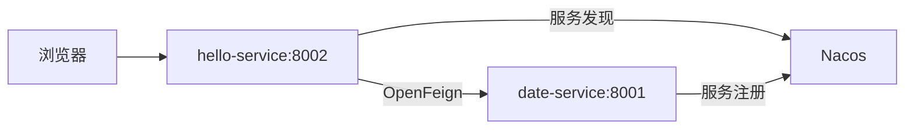

# 9-spring-cloud-ex 项目 CI/CD 实践

本章完成从代码提交到自动部署的完整链路。

## 9-1. 项目结构说明

```text
spring-cloud-ex/
├── date-service/              # 日期服务，端口 8001
├── hello-service/             # 页面服务，端口 8002，通过 OpenFeign 调 date-service
├── deploy/helm/spring-cloud-demo/
│   ├── Chart.yaml
│   ├── values.yaml
│   ├── values-dev.yaml
│   ├── values-test.yaml
│   ├── values-prod.yaml
│   └── templates/
├── Jenkinsfile                # Jenkins 多分支流水线
└── pom.xml                    # Maven 父工程
```

服务调用链：



如果 Mermaid 不展示，可以参考文本版调用链：

```text
浏览器 -> hello-service:8002 -> date-service:8001
                    \             /
                     \           /
                      -> Nacos 注册中心
```

## 9-2. 修改项目中的地址

需要根据自己的环境修改：

| 文件 | 配置 |
|---|---|
| `Jenkinsfile` | `HARBOR_REGISTRY`、`HARBOR_PROJECT`、`NACOS_ADDR`、Agent 镜像地址 |
| `deploy/helm/spring-cloud-demo/values*.yaml` | 镜像仓库、Nacos 地址、NodePort |
| `deploy/helm/spring-cloud-demo/templates/*.yaml` | 环境变量、健康检查、nodeSelector |

如果你的 Harbor 是：

```text
10.1.106.200:8088
```

业务镜像地址最终应类似：

```text
10.1.106.200:8088/devops-demo/date-service:develop-a1b2c3d4
10.1.106.200:8088/devops-demo/hello-service:develop-a1b2c3d4
```

当前项目的 `Jenkinsfile` 示例默认使用内网 Harbor 中的 CI 工具镜像：

```text
10.1.106.200:8088/ci-tools/maven:3.9.9-eclipse-temurin-8
10.1.106.200:8088/ci-tools/eclipse-temurin:8-jre
10.1.106.200:8088/ci-tools/kaniko-executor:v1.23.2-debug
10.1.106.200:8088/ci-tools/helm-kubectl:3.16.3
10.1.106.200:8088/ci-tools/jenkins-inbound-agent:3355.v388858a_47b_33-3-jdk21
```

如果你没有提前同步这些镜像，可以临时改成公网官方镜像；如果集群不能访问公网，则必须按 `06-harbor-install.md` 先同步到 Harbor。

两个业务服务的 Dockerfile 也有基础镜像参数：

```Dockerfile
ARG BASE_IMAGE=10.1.106.200:8088/ci-tools/eclipse-temurin:8-jre
```

请检查并修改这两个文件：

```text
date-service/Dockerfile
hello-service/Dockerfile
```

确保 `BASE_IMAGE` 指向你的 Harbor 地址，而不是别人的私有仓库地址。

如果你不想把 JRE 基础镜像同步到 Harbor，也可以把 `date-service/Dockerfile` 和 `hello-service/Dockerfile` 改成官方镜像：

```Dockerfile
ARG BASE_IMAGE=eclipse-temurin:8-jre
```

不要改成 `eclipse-temurin:8-jre-alpine`，因为当前 Dockerfile 使用了 `groupadd`、`useradd`，Alpine 镜像默认没有这些命令。

但这要求 Jenkins Agent Pod 所在的 Kubernetes 节点能访问 Docker Hub。生产部署更推荐把基础镜像同步到 Harbor，构建速度和可用性更稳定。

## 9-3. Jenkinsfile 关键变量检查

打开 `Jenkinsfile`，确认这些值和你的环境一致：

```groovy
HARBOR_REGISTRY = '10.1.106.200:8088'
CI_TOOLS_PROJECT = 'ci-tools'
HARBOR_PROJECT = 'devops-demo'
HELM_RELEASE = 'spring-cloud-demo'
CHART_DIR = 'deploy/helm/spring-cloud-demo'
NACOS_ADDR = 'nacos.nacos.svc.cluster.local:8848'
NACOS_AUTH_SECRET = 'nacos-auth'
```

如果你的 Kubernetes 节点全部都已经能拉取 HTTP Harbor 镜像，可以保留：

```yaml
nodeSelector:
  harbor-insecure: "true"
```

如果你没有给节点打这个标签，Jenkins Agent Pod 会一直 Pending。处理方式二选一：

```bash
kubectl label node k8s-master harbor-insecure=true --overwrite
```

或删除 Jenkinsfile 和 Helm values 中的 `nodeSelector` 限制。

## 9-4. 提交前必须确认的项目文件

在推送代码到 GitLab 前，至少确认这些文件已经改成自己的环境：

| 文件 | 必须确认 |
|---|---|
| `Jenkinsfile` | CI 工具镜像地址、`HARBOR_REGISTRY`、`HARBOR_PROJECT`、`NACOS_ADDR` |
| `date-service/Dockerfile` | `BASE_IMAGE` 指向自己的 Harbor 或官方 `eclipse-temurin:8-jre` |
| `hello-service/Dockerfile` | `BASE_IMAGE` 指向自己的 Harbor 或官方 `eclipse-temurin:8-jre` |
| `deploy/helm/spring-cloud-demo/values.yaml` | `global.imageRegistry`、`global.imageProject`、`global.nacosAddr`、`global.nodeSelector` |
| `deploy/helm/spring-cloud-demo/values-dev.yaml` | `helloService.service.nodePort` 为 `30080` |
| `deploy/helm/spring-cloud-demo/values-test.yaml` | `helloService.service.nodePort` 为 `30081` |
| `deploy/helm/spring-cloud-demo/values-prod.yaml` | `helloService.service.nodePort` 为 `30082` |

本项目的 `application.yml` 默认 Nacos 地址是 `127.0.0.1:8848`，这是本地开发默认值。部署到 K8s 时，Helm 模板会通过环境变量覆盖为：

```text
SPRING_CLOUD_NACOS_DISCOVERY_SERVER_ADDR=nacos.nacos.svc.cluster.local:8848
```

因此无需直接修改 `date-service/src/main/resources/application.yml` 和 `hello-service/src/main/resources/application.yml`。

## 9-5. Jenkinsfile 流水线阶段

流水线包含：

| 阶段 | 作用 |
|---|---|
| `Resolve Environment` | 根据分支计算环境、Namespace、镜像 Tag |
| `Maven Build` | 执行 `mvn clean package` |
| `Prepare Kaniko Auth` | 写入 Harbor 登录认证 |
| `Build and Push Images` | 构建并推送两个服务镜像 |
| `Approval` | `main` 或 `v*` tag 生产发布前人工确认 |
| `Helm Deploy` | 部署到 K8s |
| `Verify Deployment` | 检查 Pod、Service，并访问页面验证 |

## 9-6. Jenkins 动态 Agent Pod 说明

Jenkinsfile 使用 Kubernetes 动态 Agent。一个构建任务会临时创建一个 Pod，里面有多个容器：

| 容器 | 镜像示例 | 用途 |
|---|---|---|
| `jnlp` | `jenkins/inbound-agent` | 连接 Jenkins Controller |
| `maven` | `maven:3.9.9-eclipse-temurin-8` | 编译 Java 项目 |
| `kaniko` | `gcr.io/kaniko-project/executor:v1.23.2-debug` | 构建并推送镜像 |
| `helm` | `helm-kubectl:3.16.3` | 执行 `helm`、`kubectl` |

如果你的 Kubernetes 节点不能访问公网，需要先把这些镜像同步到 Harbor，然后在 `Jenkinsfile` 中使用 Harbor 地址。

## 9-7. 同步官方工具镜像到 Harbor

Jenkins Agent 使用的工具镜像全部从官方或发布方镜像仓库获取，然后重新打 tag 推送到自己的 Harbor。

### 9-7-1. 官方/发布方镜像地址

| 用途 | 官方/发布方镜像 | 说明 |
|---|---|---|
| Maven 构建 | `maven:3.9.9-eclipse-temurin-8` | Docker Hub Maven Official Image |
| Java 运行时基础镜像 | `eclipse-temurin:8-jre` | Docker Hub Eclipse Temurin Official Image |
| Jenkins inbound agent | `jenkins/inbound-agent:3355.v388858a_47b_33-3-jdk21` | Jenkins 官方 Agent 镜像 |
| Kaniko 构建镜像 | `gcr.io/kaniko-project/executor:v1.23.2-debug` | Kaniko 官方执行器镜像 |
| Helm + kubectl 工具 | `dtzar/helm-kubectl:3.16` | 发布方镜像，内置 `kubectl`、`helm`；推送到 Harbor 后命名为 `helm-kubectl:3.16.3` 以匹配当前 Jenkinsfile |

说明：

- `dtzar/helm-kubectl:3.16` 是发布方提供的 Helm + kubectl 工具镜像，包含 Helm 3.16.x 和对应 kubectl 工具。
- 当前 Jenkinsfile 历史使用 Harbor 目标名 `10.1.106.200:8088/ci-tools/helm-kubectl:3.16.3`，因此同步时保留这个 Harbor tag，避免改动已验证过的流水线配置。
- 不建议在 Jenkinsfile 中直接使用公网镜像，生产部署更推荐先同步到 Harbor，保证构建稳定性和可控性。

### 9-7-2. 拉取官方镜像并推送到 Harbor

先登录 Harbor：

```bash
docker login 10.1.106.200:8088 -u admin -p 'Harbor@123456'
```

同步 Maven 镜像：

```bash
docker pull maven:3.9.9-eclipse-temurin-8
docker tag maven:3.9.9-eclipse-temurin-8 10.1.106.200:8088/ci-tools/maven:3.9.9-eclipse-temurin-8
docker push 10.1.106.200:8088/ci-tools/maven:3.9.9-eclipse-temurin-8
```

同步 Java 运行时基础镜像：

```bash
docker pull eclipse-temurin:8-jre
docker tag eclipse-temurin:8-jre 10.1.106.200:8088/ci-tools/eclipse-temurin:8-jre
docker push 10.1.106.200:8088/ci-tools/eclipse-temurin:8-jre
```

同步 Jenkins inbound agent 镜像：

```bash
docker pull jenkins/inbound-agent:3355.v388858a_47b_33-3-jdk21
docker tag jenkins/inbound-agent:3355.v388858a_47b_33-3-jdk21 10.1.106.200:8088/ci-tools/jenkins-inbound-agent:3355.v388858a_47b_33-3-jdk21
docker push 10.1.106.200:8088/ci-tools/jenkins-inbound-agent:3355.v388858a_47b_33-3-jdk21
```

同步 Kaniko 镜像：

```bash
docker pull gcr.io/kaniko-project/executor:v1.23.2-debug
docker tag gcr.io/kaniko-project/executor:v1.23.2-debug 10.1.106.200:8088/ci-tools/kaniko-executor:v1.23.2-debug
docker push 10.1.106.200:8088/ci-tools/kaniko-executor:v1.23.2-debug
```

同步 Helm + kubectl 工具镜像：

```bash
docker pull dtzar/helm-kubectl:3.16
docker tag dtzar/helm-kubectl:3.16 10.1.106.200:8088/ci-tools/helm-kubectl:3.16.3
docker push 10.1.106.200:8088/ci-tools/helm-kubectl:3.16.3
```

### 9-7-3. Jenkinsfile 中使用 Harbor 镜像

同步完成后，确认 `Jenkinsfile` 中 Agent Pod 镜像使用 Harbor 地址：

```yaml
- name: maven
  image: 10.1.106.200:8088/ci-tools/maven:3.9.9-eclipse-temurin-8
- name: kaniko
  image: 10.1.106.200:8088/ci-tools/kaniko-executor:v1.23.2-debug
- name: helm
  image: 10.1.106.200:8088/ci-tools/helm-kubectl:3.16.3
- name: jnlp
  image: 10.1.106.200:8088/ci-tools/jenkins-inbound-agent:3355.v388858a_47b_33-3-jdk21
```

同时确认两个业务服务 Dockerfile 使用 Harbor 中的 JRE 基础镜像：

```Dockerfile
ARG BASE_IMAGE=10.1.106.200:8088/ci-tools/eclipse-temurin:8-jre
```

## 9-8. 配置 Helm values

`values-dev.yaml` 示例：

```yaml
global:
  imageRegistry: 10.1.106.200:8088
  imageProject: devops-demo
  nacosAddr: nacos.nacos.svc.cluster.local:8848
  nacosNamespace: dev
  nacosAuth:
    enabled: true
    secretName: nacos-auth

helloService:
  service:
    type: NodePort
    nodePort: 30080
```

`values-test.yaml` 使用 `nodePort: 30081`，`values-prod.yaml` 使用 `nodePort: 30082`。

## 9-9. 准备 Nacos 命名空间

如果希望 dev/test/prod 服务在 Nacos 中隔离，需要在 Nacos 页面创建命名空间：

| 环境 | Nacos Namespace ID |
|---|---|
| dev | `dev` |
| test | `test` |
| prod | `prod` |

如果不创建，服务可能注册失败或注册到默认 `public`。

## 9-10. 首次推送代码

```bash
git remote add gitlab http://10.1.106.200:8929/root/spring-cloud-ex.git || git remote set-url gitlab http://10.1.106.200:8929/root/spring-cloud-ex.git

git checkout main
git push gitlab main

# 如果本地已有 develop 分支会直接切换；没有则从 main 创建。
git checkout develop 2>/dev/null || git checkout -b develop main
git push gitlab develop
```

Jenkins 多分支任务扫描后，应发现 `main` 和 `develop`。

如果没有自动发现，进入 Jenkins 的 `spring-cloud-ex` 多分支任务，手动点击：

```text
Scan Multibranch Pipeline Now
```

如果希望推送代码后立即触发，需要在 GitLab 项目 `Settings` -> `Webhooks` 中配置 Jenkins Webhook；当前部署案例也可以先使用 Jenkins 定时扫描，后续再切换为 Webhook 触发。

## 9-11. 触发 dev 环境部署

修改任意代码后提交到 `develop`：

```bash
git checkout develop
git add .
git commit -m "test cicd deploy"
git push gitlab develop
```

Jenkins 会执行：

```text
develop -> 构建镜像 -> 推送 Harbor -> Helm 部署 dev namespace -> 验证 30080
```

## 9-12. 查看 Jenkins 构建结果

进入 Jenkins：

```text
http://10.1.106.201:8080/job/spring-cloud-ex/
```

查看 `develop` 分支构建日志，确认：

- Maven 构建成功。
- Kaniko 推送两个镜像成功。
- Helm 部署成功。
- Smoke Test 输出成功。

## 9-13. 验证 Kubernetes 资源

在 K8s master 执行：

```bash
kubectl -n dev get pods,svc -o wide
helm list -n dev
helm get values spring-cloud-demo -n dev
```

预期：

```text
date-service    1/1 Running
hello-service   1/1 Running
hello-service   NodePort 8002:30080/TCP
```

## 9-14. 验证业务访问

浏览器访问：

```text
http://10.1.106.71:30080
```

或命令行：

```bash
curl http://10.1.106.71:30080
```

页面中应包含：

```text
你好
```

## 9-15. test 和 prod 发布

发布 test：

```bash
git checkout -b release/1.0.0 develop
git push gitlab release/1.0.0
```

发布 prod 到 `main`：

```bash
git checkout main
git merge release/1.0.0
git push gitlab main
```

`main` 分支会进入生产发布流程，Jenkins 中需要人工点击确认。

如果需要发布不可变版本号，也可以额外打 `v*` tag：

```bash
git tag v1.0.0
git push gitlab v1.0.0
```

`v*` tag 同样会进入生产发布流程，并需要人工点击确认。

---

> 微信: wingsreops
